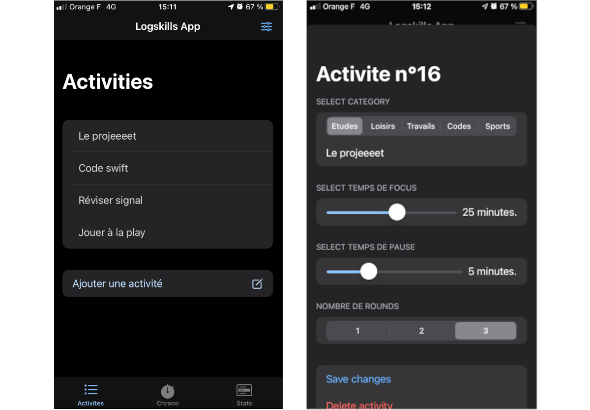
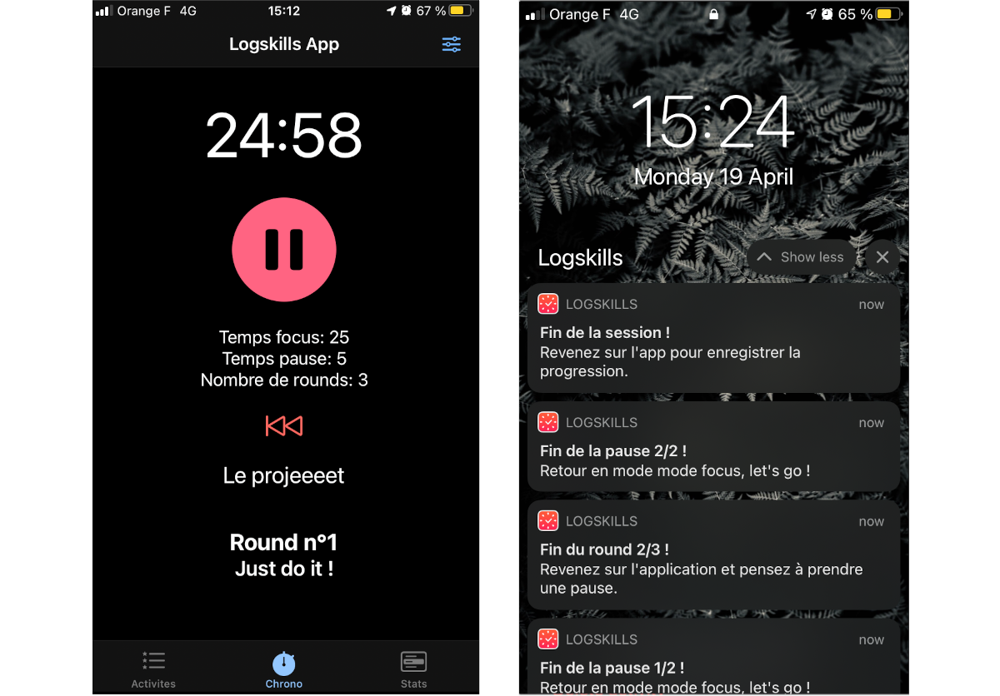
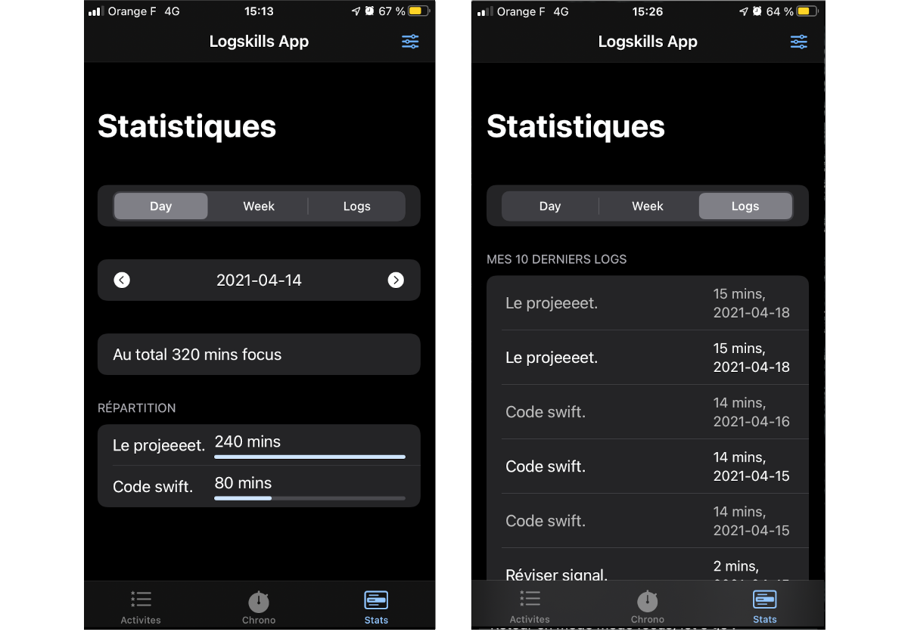
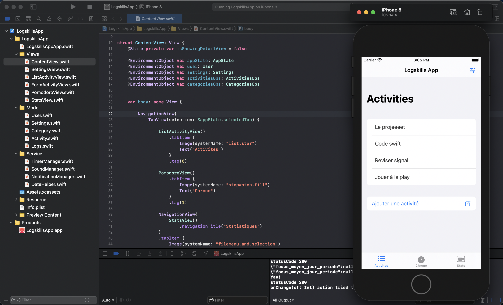

### Logskills App iOS

#### Objectif de l'app

Savoir mieux évaluer son temps sur diverses activités et augmenter sa motivation grâce à une application inspirée de la méthode pomodoro.

Créer une application mobile permettant d’appliquer la méthode pomodoro (méthode d’aide à la concentration sur une tâche définie).

#### Aperçu de l'application

*Figure 1 : Aperçu du CRUD de création des activités.*

*Figure 2 : Aperçu du chrono / méthode pomodoro.*

*Figure 3 : Aperçu des statistiques.*

#### Code source

Retrouvez ici le code source de notre application Logskills réalisée avec le framework SwiftUI.

Pour en apprendre plus sur la framework SwiftUI je vous recommande vivement les cours de https://www.hackingwithswift.com

*Voici un point d'entrée vers le cours sur SwiftUI :*

https://www.hackingwithswift.com/articles/196/learn-swiftui-with-free-tutorials

Figure 4 : Aperçu de notre environement de develeppement iOS sur xcode.

